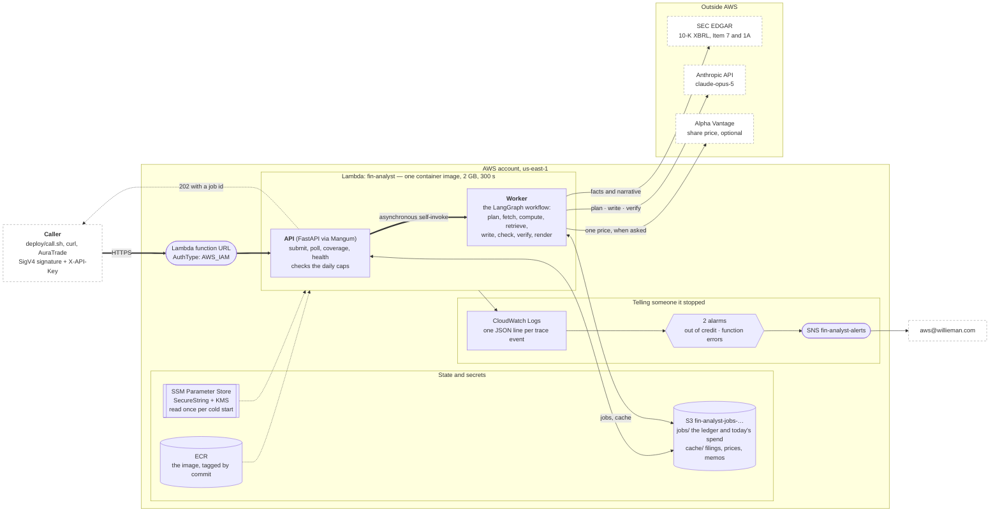
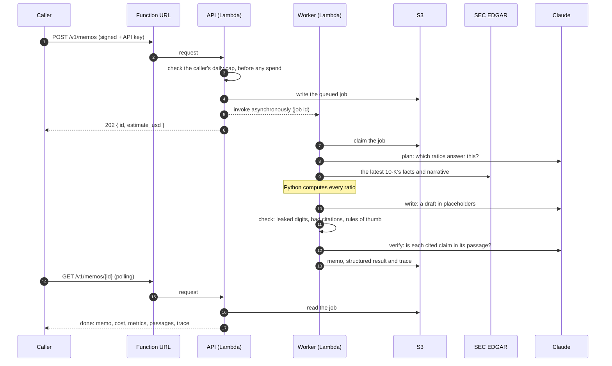
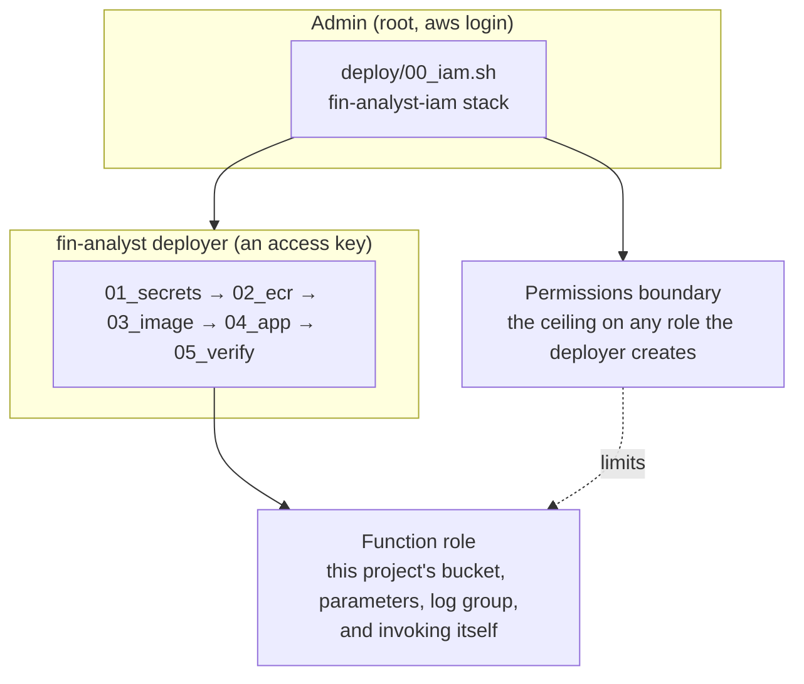

# The stack on AWS

One Lambda function, one S3 bucket, and nothing that runs when nobody is asking. The whole thing
costs a few cents a month at rest; the money is in the Claude calls, which is why the spending caps
sit in front of them.

Everything here is created by CloudFormation from `infra/`, deployed by the numbered scripts in
`deploy/`. Calling it is [`CALLING.md`](CALLING.md); the plan behind it is
[`API_PLAN.md`](API_PLAN.md).

## The architecture

*(GitHub renders the diagram below; [`architecture.png`](architecture.png) is the same picture as an
image, for anywhere that doesn't.)*

**Why a function URL rather than API Gateway.** A memo takes 20 seconds to a minute, and API
Gateway stops waiting at 30. The submission returns immediately either way, so the gateway would
add a hop, a cost and a second thing to configure for nothing. The tradeoff is that a function URL
has no custom domain of its own: that needs API Gateway in front, which is
[tabled](API_PLAN.md#phase-c--public-endpoint-optional-and-last).

**Why the function invokes itself.** The memo has to outlive the request. The API answers with a
job id in well under a second, then invokes the same function asynchronously with that id; the
second invocation runs the workflow and writes the result to S3. One function, one image, one set
of permissions — and the worker gets Lambda's own retry and timeout behaviour for free.

## What happens on one memo

A failed check sends the draft back to `write`; three failures publish nothing and record why.

## What each piece is for

| Resource | Why it exists | What it costs |
|---|---|---|
| **Lambda** `fin-analyst` | the API and the worker, one container image | per request; idle costs nothing |
| **Function URL**, `AWS_IAM` | the front door: AWS checks the SigV4 signature before any code runs | free |
| **ECR** repository | the image, tagged with the commit it was built from | ~$0.10/GB/month |
| **S3** `fin-analyst-jobs-…` | `jobs/` the ledger and today's spend; `cache/` filings by accession, prices by day, memos by hash | cents |
| **SSM Parameter Store** | the Anthropic key, the API keys, the SEC identity: SecureString, read at cold start, never in the image | free |
| **CloudWatch Logs** | one JSON line per trace event, 14-day retention | cents |
| **SNS + 2 alarms** | tells someone when the account runs out of credit or the function errors | ~$0.20/month |
| **IAM role + permissions boundary** | the function may touch only this project's bucket, parameters and log group | free |

The costs that matter are Claude's: about $0.03–0.09 a memo, capped per run, per caller per day,
and across the service per day.

## Who may do what

Two locks guard the service itself, and a request needs both: an **AWS SigV4 signature**, checked
by AWS before any of this code runs, and an **`X-API-Key`**, checked by the app so a daily spending
cap can be charged to the caller who used it. The details, and how to sign a request by hand, are
in [`CALLING.md`](CALLING.md).

## When it breaks

| What happens | Where it shows up | Does it alert? |
|---|---|---|
| The Anthropic account is out of credit | every run fails on its first call, spending nothing | **yes**, by email |
| The function crashes, times out, or a deploy is bad | Lambda's `Errors` metric | **yes**, by email |
| A memo can't pass its own checks | the job's `error`, and the trace | no: this is the design working |
| A ratio can't be computed | `"not available"` with the reason, in the memo | no |
| EDGAR or Alpha Vantage is unreachable | the job fails, or the valuation ratios report themselves unavailable | no |

Nothing here is investment advice, and a caller must never wait on a memo to make a decision.
